## About:
 This article elaborates the internal processes that happen when the code has begun to run until the output is achieved in a javascript program.
## Javascript is a single-threaded language:
To explain what a single-threaded language is knowing about Call Stack is necessary.
### Call Stack:
It is a data structure similar to arrays and linked lists which contains the function that has to be executed.
When the interpreter goes through the code and stumbles upon a function call it pushes it into the call stack for the function to be executed and when the function is done executed it pops(removes) the function from the call stack.
The Last fuction to get pushed is the first one to pop out.
Let me explain using Two Examples:
#### Example 1:
```javascript
function first(){
    console.log("First function")
}
function second(){
    console.log("Second function")
}
function third(){
    console.log("Third function")
}

first();

second();

third();

```
Here the function `first()` is called at line 11. When the javascript interpreter stumbles upon the function call it  sends it to the call stack as shown below . 
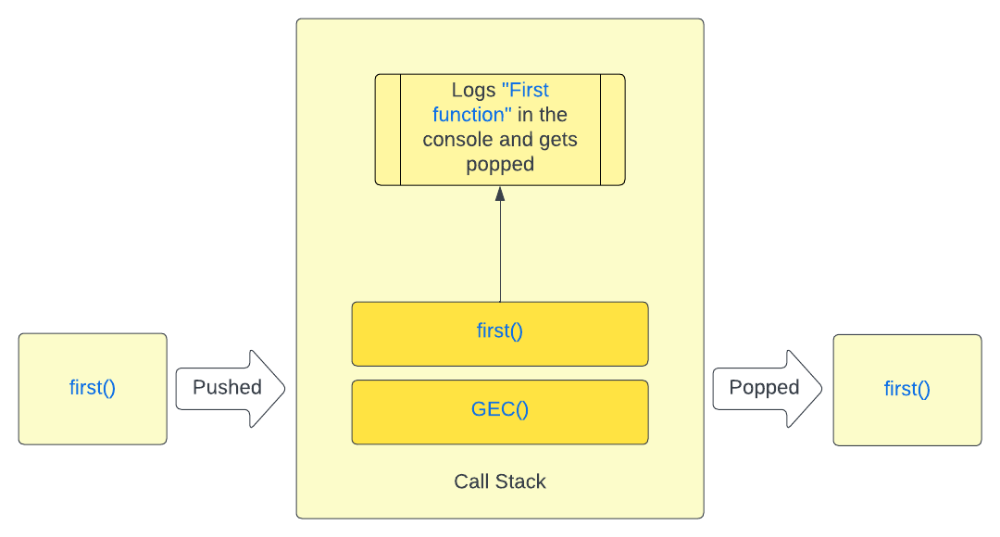
Similarly the same process of pushing and popping occurs for the `second()` and `third()` function. `GEC()` stands for Global Execution Context which will be dealt with later on.
#### Example 2:
```javascript
function first(){
    console.log("First function")
    second()
}
function second(){
    console.log("Second function")
    third();
}
function third(){
    console.log("Third function")
}

first();
```
In this program `first()` calls  `second()` which internally calls `third()`. In this case when the interpreter stumbles on the function call at line 13 the following process happens.
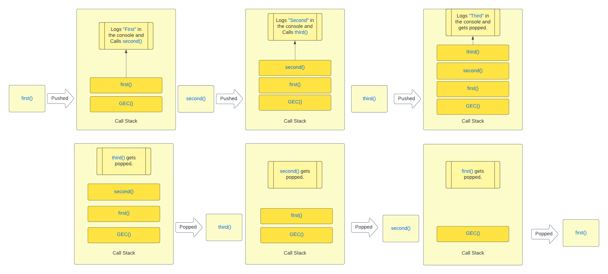
In the function call `third()` was the last one to get pushed and hence is the first one to pop out followed by `second()` then `third()` following the LIFO(Last in First Out) order .

Now that we know what a call stack is, javascript at its core is a single-threaded language which means that it has only one call stack through which things happen one at a time. Blocking of this single thread can stop the whole program and when done in a web environment will suspend the interactivity of the web app.

## Execution Context:
An Execution Context is a special enivornment created to handle the transformation and execution of Javascript Code. It contains the Javascript Code along with everything that aids in its execution.There are two types of EC:
#### Global Execution Context: 
The Javascript Code which is not present inside a function gets executed in the GEC. It is also known as base / default execution.
#### Function Execution Context: 
This type of context is created when any function call is found and is used to execute the code within that function. Each function has its own Execution Context and there can be more than one FEC in the call stack.

###  `Call Stack is a collection of Execution Contexts` 
>As seen in the diagrams above we had `GEC()` (Global Execution Context) along with a new Function Execution Context for each function call encountered being pushed and popped with respect to its execution. Call Stack is also known as the Execution Stack.

### Creation of an Execution Context:
The creation of an execution context occurs in 2 phases: 
#### 1. Creation Phase:
The following happens in  Creation Phase:
1. The Global Object is Created (window for browser, global for node.js)
2. `this` object is created and binded to the global object.
3. Sets up the memory heap for storing variables and function references .
>Function reference is like a pointer to the function in memory that can be used to call the function later
4. Functions and Variables are stored in the Global Execution Context with their values set to `undefined`. 
#### 2. Execution Phase:
The following happens in an Execution Phase:
1. The Javascript Code is Executed Line by Line.
2. When a function call is encountered it creates a new Execution Context for it and pushes it into the Call Stack.

Lets understand it using an example:
```javascript
var x = 100;
var y = 50;
function getSum(n1, n2){
    var sum = n1 + n2;
    return sum;
}

var sum1 = getSum(x, y);
var sum2 = getSum(10, 5);
```
### Creation Phase:
1. The Global Object is Created (window for browser, global for node.js)
2. `this` object is created and binded to the global object.
3.  Storing and Initialization of variables and functions.<br>
Line 1: `x` is allocated memory and initialized to `undefined`.<br>
Line 2: `y` is allocated memory and initialized to `undefined`. <br>
Line 3: `getSum()` is allocated memory and it's code is stored.<br>
Line 8: `sum1` is allocated memory and initialized to `undefined`.<br>
Line 9: `sum2` is allocated memory and initialized to `undefined`.<br><br>
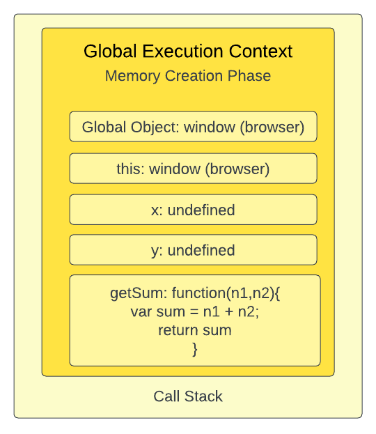
<br>
### Execution Phase: 
>During execution phase the code is executed line by line. It assigns values to variables and executes the function calls if it encounters any.

Line 1:  `x` is assigned a value of `100`.<br>
Line 2:  `y` is assigned a value of `50`.<br>
Line 3:  Skips the function because there is nothing to execute (not a function call).<br>
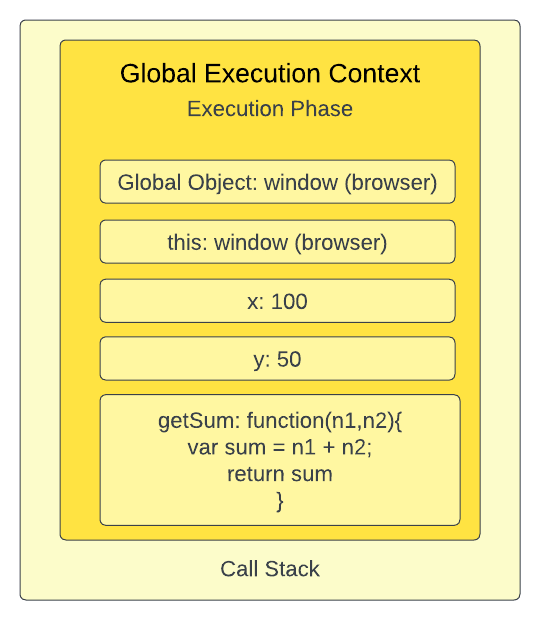
<br>
Line 8: Invokes `getSum()` function and creates a new FEC (Function Execution Context) for it and pushes it into the Call Stack.
#### FEC Creation Phase: 
Line 3: `n1` and `n2` are allocated memory and initialized to `undefined`.<br>
Line 4: `sum` variable is allocated memory and initialized to `undefined`.<br> <br>
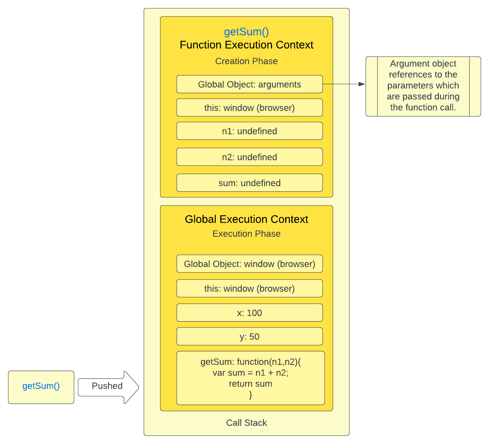
<br>
#### FEC Execution Phase:
Line 3: `n1` and `n2` are assigned 100 and 50 respectively.<br>
Line 4: `sum` is assigned the final value of the calculation i.e. 150.<br>
Line 5:  `return` tells the FCE to return the value of `sum` i.e. `150` to the GEC (Global Execution Context).<br>

FCE is popped from the Call Stack since it's execution is done. Now back to GEC Execution Phase.<br>
Line 9: Invokes `getSum()` function and creates a new FEC (Function Execution Context) for it and pushes it into the Call Stack. Pretty much the same happens except the parameters passed here are `10` and `5`.<br>

Let's discuss some topics which are impacted by the knowledge of Execution Context.

### Hoisting: 
Since we know about the creation of Execution Context and it's phases we can understand how hoisting works with an example.
```javascript
console.log(x)
var x = 1;
console.log(getHello())
function getHello() {
    return "Hello World"
};
```
In this code we try to log the value of `x` in the console which is declared in Line 2 and we get the output `undefined`.
>During the Creation Phase variable `x` is allocated memory and initialized to `undefined`. In Execution Phase we log it to the console in Line 1 before we assign `1` to `x` in Line 2 , hence  we get `undefined`  logged in the console which is `x`'s initialized value in the Creation Phase.

For `getHello()` we try to log its return value but the function is declared in Line 4 and we get the desired `Hello World` logged in the console.
>During the Creation Phase `getHello()` gets stored in the memory. Hence, during Execution Phase when the function is called it refers to the already stored `getHello()`. 

### `var` vs `let` and `const`:
```javascript
console.log(varX);
console.log(letX);
console.log(constX);

var varX = 10;
let letX = 20;
const constX = 30;
```
In the code above only varX logs as `undefined` where as letX and constX give error. 
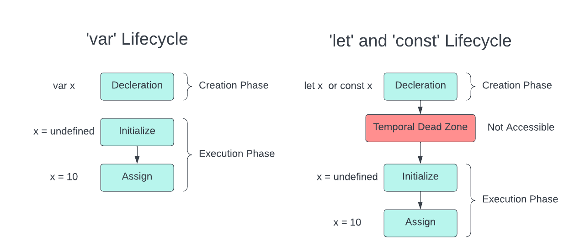
>Unlike `var` which is available after the Creation Phase initialized to `undefined`. `let` and `const`  have a `Temporal Dead Zone` where their values are not accessible until they are assigned a value in the Execution Phase.
Hence, we get an error trying to log `letX` and `constX` in Line 2 and 3 where as they are assigned values later in Line 6 and 7 respectively. 


## Asynchronous Javascript:
In this section we will understand how Javascript deals with asynchronous code without blocking the main thread it works on. First lets learn about what Synchronous and Asynchronous mean in Javascript:
#### Synchronous Code:
We know that Javascript code is executed line by line, when a particular line / block of code takes some time to complete the operation it blocks the whole thread until it is done. Such code is known as blocking code. For Example:
```javascript
console.log("First Line")

let i = 0;

for(i = 0; i < 5; i++) {
    console.log("Taking Time")
}

console.log("Last Line")
```
Output: 
```bash 
First Line
Taking Time
Taking Time
Taking Time
Taking Time
Taking Time
Last Line 
```
In the above code the `for` loop logs `Taking Time` in the console 5 times and only then we see `Last Line` which shows that while the `for` loop was running it was blocking the execution of the remaining code until the loop was completed and once it was finished the execution of following lines of code occured. This is an example of Synchronous or Blocking Code. Now you might have a doubt that since Javascript is a synchronous, single-threaded language how does it handle multiple event listeners, timeout functions, etc... without causing the web / backend app to suspend until each operation is executed. Well it happens Asynchronously in a non-blocking way explained in detail below.
#### Asynchronous Code:
Asynchronous or non-blocking code is the type of code which does not suspend the execution of the rest of the program when a time taking operation is encountered. To write Asynchronous Code in Javscript we take the help of the Web Api provided by the global object  (browser for a web app), in case of a backend app C/C++ Api's are used. They provide functions, DOM Events, etc.. to make the code work asynchronously without blocking the main thread.  Now let's do the same as above but this time using `setTimeout()` provided by the Web Api and passing it a call back function. 
> Call Back Function is a function that is passed as an argument to another function. In the code below `logHelloWorld()` is a function that is passed as an argument to the `setTimeout()` function, hence it is a call back function

Code: 
```javascript 
console.log("First Line")

function logHelloWorld () {
  console.log("Hello World")
}

setTimeout(logHelloWorld, 1000);

console.log("Last Line")
```
Output: 
```bash 
First Line
Last Line
Hello World
```
We get `First Line`, `Last Line` followed by `Hello World` at the end, which shows that the `setTimeout()` function in Line 7 did not suspend the execution of the rest of the code even tho we used it to execute `logHelloWorld()` after 1000 ms. The internal working of it line by line is explained below <br>
Line 1: `console.log("First Line")` is pushed to the call stack for  execution and when done it is popped off.<br>
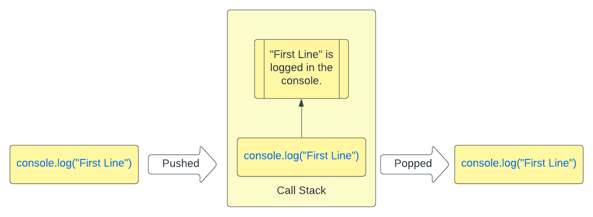
Line 3: No Function is called, hence skipped.<br>
Line 7: `setTimeout()` is pushed to the Call Stack with it's two arguments `logHelloWorld` which is a call back function and `1000` which is time of delay in ms. So a timer of 1000 ms is set in the Web Api environment along with it the call back function is registered and the `setTimeout()` is popped from the call stack.<br>
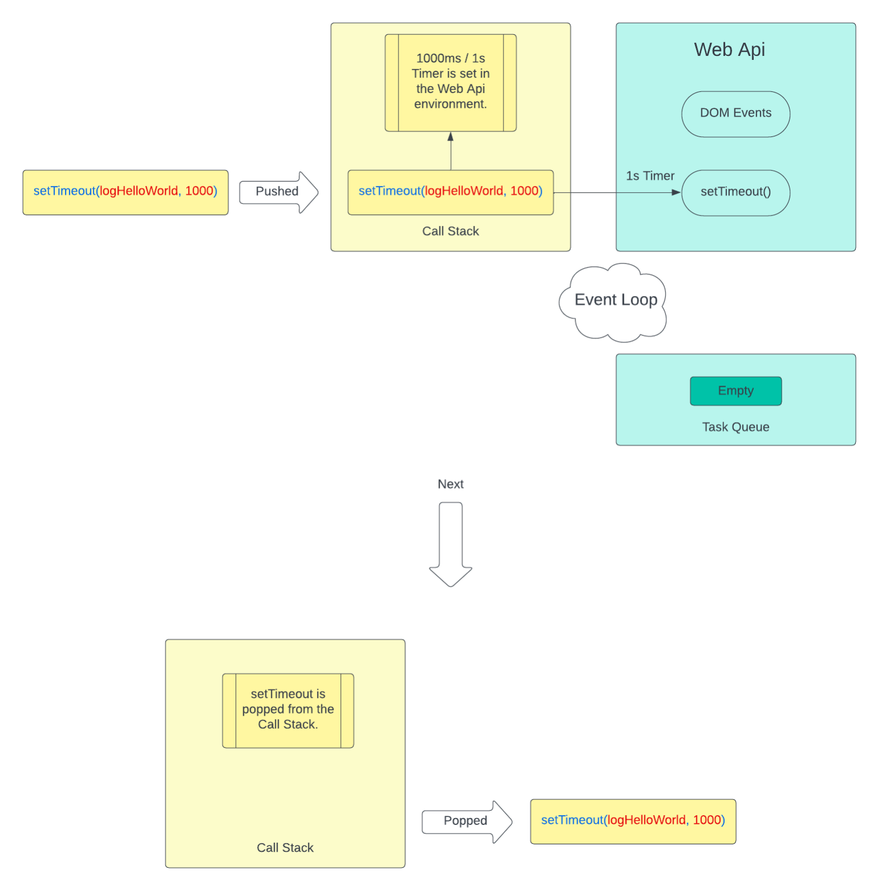
Line 9: `console.log("Last Line")` is pushed to the call stack to be executed and popped off once it is done.<br>

When the 1000s timer is done `logHelloWorld` call back function is pushed to the Task Queue.<br> 
> Task Queue is a `queue` which is a data structure similar to Stack but follows the FIFO(First in First Out) approach.


The Event Loop makes sure that `logHelloWorld` is pused from the Task Queue to the Call Stack for it's execution. 
> Event Loop is a running process which checks if the Call Stack if empty and if found empty it checks the Task Queue, if any Call backs are found in the Task Queue it pushes them to the Call Stack for it to get executed.
 
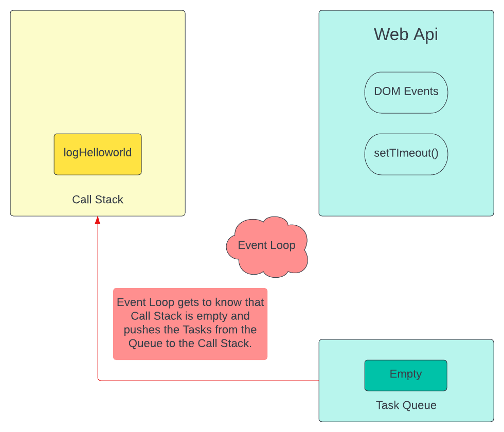
When `logHelloWorld` is pushed to the Call Stack it gets executed and `Hello World` is logged in the console.
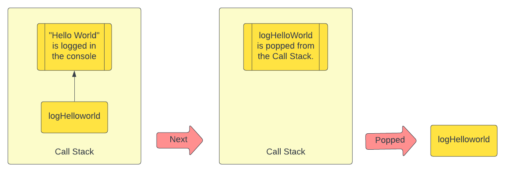
This is how an Asynchronous code works. The same happens for DOM Events such as click, mouse over, keyboard, which when triggered get registered in the web api evironment with the call back being pushed to the `Task Queue` which then is managed by the `Event Loop` to be pushed to the `Call Stack` for execution. Hence, when a DOM Event is triggered it does not suspend the main thread until its execution is complete. In the case of `Promises` the Web Api pushes them to a `queue` called `Micro-Task Queue` which has a priority higher than that of the `Task Queue` causing the Tasks in `Micro-Task Queue` to be pushed to the `Call Stack` prior to the Tasks present in the `Task Queue` by the `Event Loop`.
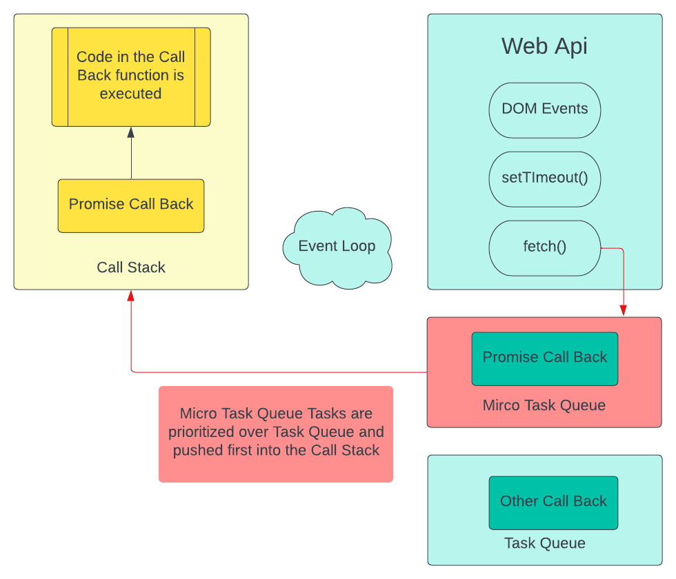
For Example: 
```javascript
console.log("First Line")


setTimeout(()=>{
    console.log("Timeout 1 executed")
}, 0)

setTimeout(()=>{
    console.log("Timeout 2 executed")
}, 0)


new Promise((resolve, reject) => {
    resolve('Promise 1 resolved ');
  }).then(res => console.log(res))
    .catch(err => console.log(err));

new Promise((resolve, reject) => {
        resolve('Promise 2 resolved');
      }).then(res => console.log(res))
        .catch(err => console.log(err));


console.log("Last Line")
```
Output: 
```bash
First Line
Second Line
Promise 1 resolved
Promise 2 resolved
Timeout 1 executed
Timeout 2 executed
```
From the output of the code example above we can see that both the promises are executed prior to the `setTimeout` functions because of `Promises` being pushed to  the prioritized `Micro-Task Queue` which get pushed into the Call Stack prior to `Task Queue`. 

## Memory Storage:
Storage of variables differs depending on the Data Type. In Javascript there are 2 Data Types `Primitive` and `Reference` types.
#### Primitive Type :
Primitive Types are stored directly in the stack from where they are accessed since they have a constant size.
1. String
2. Number
3. Boolean
4. Null
5. Undefined
6. Symbol
7. BigInt
#### Reference Type :
Reference Types are stored in the memory heap and their value is accessed by a reference pointing towards its value in the memory heap. 
1. Arrays
2. Functions 
3. Objects<br>
Let's understand using few examples:<br>
In the example below we have two variables `name` and `age` with values `Jhon` and `30` assigned to them. Since they are primitive data types they are stored directly in the stack as shown in the below diagram.
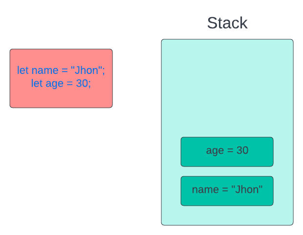<br>
Now in this example, we have considered `person` an object which is of the Reference Type. We can see below that the value of `person` an object is  in the memory heap rather than the stack and variable name `person` is pointing towards its value in the memory heap through which it can be accessed.<br>
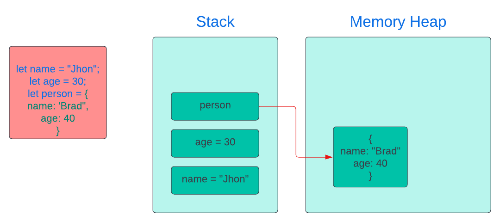
We can see more differences between them when we try to assign the value of other variable to them and try changing it as shown below.
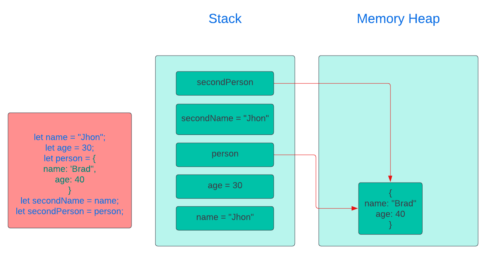
The above example has two more variables added to it `secondName` which is assigned the value of `name` which we can see is stored in the stack as `secondName = "Jhon"` but in the case of `secondPerson` to which we have assigned the value of `person`, `secondPerson` points to the same value in the memory heap which `person` is pointing towards. So, since they are pointing towards the same value changing either one of them will change the value of the object in the memory heap. For Example: 
```javascript
let person = {
name : "Brad"
age: 40
}
console.log(person.name)
let secondName = person;
//Changing the value of secondName.name
secondName.name = "Beal"
console.log(person.name)
```
Output:
```bash
Brad
Beal
```
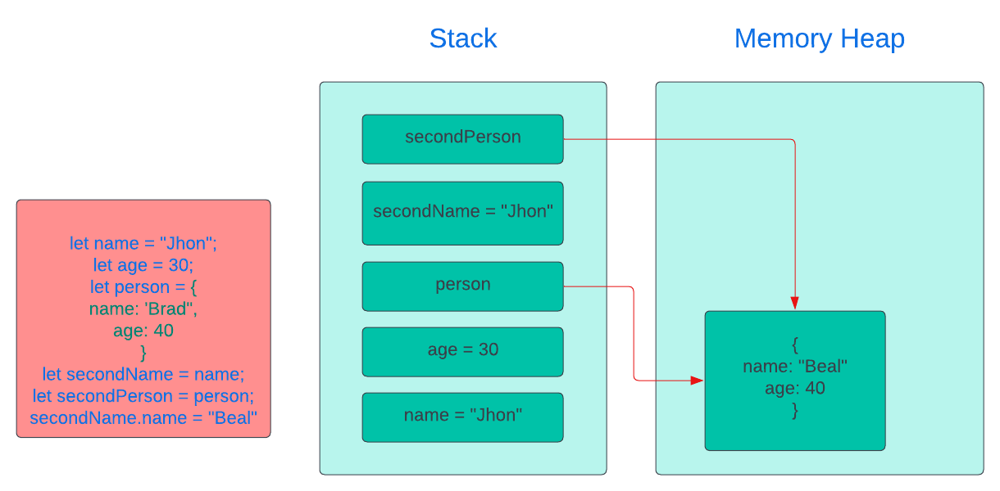
We can see from the output that when we change the value of `secondName.name` it changes the value of the object stored in the memory heap which even `person` is pointing towards. Therefore, explaining the Line 9 of the code in which gives us the output `Beal` rather than `Brad`.

#### Garbage Collection: 
Javascript is a Garbage Collected language in other words we don't have the need to manage memory by removing certain Data from the heap or stack it is automatically done by the garbage collector which removes data of variables, functions , etc.... when they are no longer needed keeping only the data which is required for further or current execution of the code. 

## Javascript Engines:
Javascript Engines are software components which convert javascript code to binary / computer understandable language. They are present in the browser and help run the js code given.
#### List of Js Engines:
| Browser      |Engine |
| ----------- | ----------- |
| Chrome      | v8 Engine    |
| FireFox   | Spider Monkey |
| Edge  | Chakra |
| Safari  | JavaScript Core |
#### Compiled vs Interpreted Languages:
Compiled languages are directly converted to machine understandable code, hence they tend to be faster than interpreted languages which get executed line by line. Compiled languages have a slower write-time (Requirement to define the type of variable and manual memory management) but faster run-time and it is the opposite for Interpreted Languages. 
#### Javascript Engine Working: 

##### Parser: 
It checks the syntax and makes sure the code does not have errors.
##### Abstraction Syntax Tree: 
After the parser checks for errors in the code and if none are found it generates an `AST` which is tree of nodes representing the code. For Example:
```javascript 
const x = 100;
function addTen (num){
return x + 10;
}
```
The above code gets converted into a tree which in json would look like something below:
```json
{
  "type": "Program",
  "start": 0,
  "end": 54,
  "body": [
    {
      "type": "VariableDeclaration",
      "start": 0,
      "end": 14,
      "declarations": [
        {
          "type": "VariableDeclarator",
          "start": 6,
          "end": 13,
          "id": {
            "type": "Identifier",
            "start": 6,
            "end": 7,
            "name": "x"
          },
          "init": {
            "type": "Literal",
            "start": 10,
            "end": 13,
            "value": 100,
            "raw": "100"
          }
        }
      ],
      "kind": "const"
    },
    {
      "type": "FunctionDeclaration",
      "start": 15,
      "end": 54,
      "id": {
        "type": "Identifier",
        "start": 24,
        "end": 30,
        "name": "addTen"
      },
      "expression": false,
      "generator": false,
      "async": false,
      "params": [
        {
          "type": "Identifier",
          "start": 32,
          "end": 35,
          "name": "num"
        }
      ],
      "body": {
        "type": "BlockStatement",
        "start": 36,
        "end": 54,
        "body": [
          {
            "type": "ReturnStatement",
            "start": 38,
            "end": 52,
            "argument": {
              "type": "BinaryExpression",
              "start": 45,
              "end": 51,
              "left": {
                "type": "Identifier",
                "start": 45,
                "end": 46,
                "name": "x"
              },
              "operator": "+",
              "right": {
                "type": "Literal",
                "start": 49,
                "end": 51,
                "value": 10,
                "raw": "10"
              }
            }
          }
        ]
      }
    }
  ],
  "sourceType": "module"
}
```
Use https://astexplorer.net/ to see the Tree version of it.
##### Interpreter: 
It converts the AST to Byte Code. It does not compile directy to Machine Code because different CPU architecture have unique machine code, but Byte Code is universal and can be optimized. 
##### JIT Compiler: 
It converts the Byte Code to machine code on the fly for the machine to execute it. 